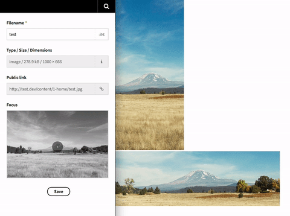

# Kirby 2 // Focus

With this plugin for [Kirby 2](http://getkirby.com) you can prevent the most important part of an image from being cropped when creating automated thumbs.

**The plugin does two things:**

1. It provides a **custom field** that allows you to set a focus point. The focus point is saved to the meta data file.
2. It provides a **new method** `focusCrop()`, which uses the focus point saved in the meta data file to crop an image in such a way that the focus point is in the center of the cropped image – or (if that's not possible) at least isn't cropped.


## Requirements

+ Kirby CMS, Version **2.3+**
+ GD Library or ImageMagick

## Please notice

Be aware that the plugin overrides the default thumbs driver for GD or ImageMagick as [described here](https://forum.getkirby.com/t/changing-toolkit-thumbs-drivers-scale-crop/2849/3?u=flokosiol).


## Preview




## Installation

### 1. Kirby CLI

If you are using the [Kirby CLI](https://github.com/getkirby/cli) you can install this plugin by running the following command in your shell from the root folder of your Kirby installation:

```
kirby plugin:install flokosiol/kirby-focus
```

### 2. Download

Of course you can also download and unpack the zip file (or simply clone the repository). If necessary, rename the folder to `focus` and put it into `site/plugins` of your Kirby installation.

Please make sure, that the plugin folder structure looks like this:

```
site/plugins/focus/
```

## Usage

### 1. Blueprint

Add the focus field to the **file fields** of your blueprint and make sure to name it `focus` like this:

```
files:
  fields:
    focus:
      label: My focus field
      type: focus
```

#### Optional setting

I recommend to keep the default field key, but if you like you are able to change it by adding the following line to your `config.php`:

```
c::set('focus.field.key', 'betterfocuskey');
```


### 2. Template

Call the `focusCrop()` method in your template:

```
<?php

  // crop a square of 200px x 200px
  echo $image->focusCrop(200);

  // crop a rectangle of 300px x 200px
  echo $image->focusCrop(300,200);

  // crop a rectangle of 200px x 400px with a quality of 80%
  echo $image->focusCrop(200,400,80);

?>
```

## Details

The x and y values are stored in the file meta field as JSON string, e.g.

```
Focus: {"x":0.42,"y":0.55}
```

If you want, you can get the values like this:

```
$focus = json_decode($file->focus()->value());
$x = $focus->x;
$y = $focus->y;
```


## Credits

Special thanks to [Tamara Chahine](https://github.com/tamarasaurus). The js part of the focus field almost exactly her [focalpoint](https://github.com/tamarasaurus/focalpoint) script with some minor adjustments.

Also special thanks to the [Kirby community](https://forum.getkirby.com/t/focus-define-an-image-focus-point/4249?u=flokosiol) for the support, especially [Thomas](https://github.com/medienbaecker), [Philippe](https://github.com/malvese) and [Sonja](https://github.com/texnixe).

Thanks to [Zac Sturgeon](https://unsplash.com/@zsturgeon64) and [Unsplash](https://unsplash.com) for the great [photo](https://unsplash.com/photos/kVlBvCsng-8).
